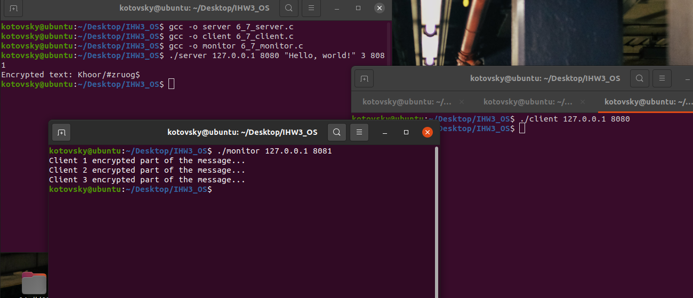

# Индивидуальное домашнее задание №3 по операционным системам

### Выполнил студент группы БПИ-219, Котовский Семён Олегович

### Вариант 33.
#### Задание:

Пляшущие человечки. На тайном собрании глав преступного мира города Лондона председатель собрания профессор Мориарти постановил: отныне вся переписка между преступниками должна вестись тайнописью. В качестве стандарта были выбраны «пляшущие человечки», шифр, в котором каждой букве латинского алфавита соответствует хитроумный значок. Реализовать приложение, шифрующее исходный текст (в качестве ключа используется кодовая таблица, устанавливающая однозначное соответствие между каждой буквой и каким - нибудь числом). Каждый процесс–шифровальщик шифрует свои кусочки текста, многократно получаемые от менеджера. Распределение фрагментов текста между процессами–шифровальщиками осуществляется процессом–менеджером, который передает каждому процессу участок текста, получает от него результат, передает следующий незашифрованный фрагмент. Он же собирает из отдельных фрагментов зашифрованный текст. Количество процессов задается опционально. Каждый процесс может выполнять свою работу за случайное время.Сервер — процесс, распределяющий текст между шифровальщиками. Клиенты — процессы–шифровальщики
### Описание решения на 4-5 баллов:

Код реализует задачу распределенного шифрования текста. Здесь два основных компонента - клиент (шифровальщик) и сервер (менеджер). Количество клиентов задается пользователем.

Сервер принимает 4 аргумента командной строки: IP-адрес, порт, текст для шифрования и количество клиентов. Каждому клиенту сервер передает фрагмент текста для шифрования. Клиенты шифруют текст, добавляя 3 к каждому символу (простой шифр Цезаря), и отправляют результат обратно на сервер. Сервер собирает все эти фрагменты в итоговый зашифрованный текст.
### Инструкция по компиляции и запуску:

Сохраните код в два файла: server.c и client.c.

Для компиляции используйте gcc:
```
gcc server.c -o server
gcc client.c -o client
```


Запустите сервер, указав IP-адрес, порт, текст для шифрования и количество клиентов:

```
./server 127.0.0.1 8080 "Hello World!" 3
```

Запустите клиентские программы, указывая IP-адрес сервера и порт:

```
./client 127.0.0.1 8080
./client 127.0.0.1 8080
./client 127.0.0.1 8080
```

Запустите все клиенты одновременно. Каждый клиент получит свой фрагмент текста, зашифрует его и отправит обратно на сервер. Сервер собирает зашифрованные фрагменты в один текст и выводит его на экран.

### Описание решения на 6-7 баллов:

Доработанный код реализует задачу распределенного шифрования текста, включая возможность наблюдения за процессом шифрования. Здесь три основных компонента - клиент (шифровальщик), сервер (менеджер) и наблюдатель (observer). Количество клиентов определяется пользователем.

Сервер принимает 6 аргументов командной строки: IP-адрес, порт, текст для шифрования, количество клиентов и порт для наблюдателя. Каждому клиенту сервер передает фрагмент текста для шифрования. Клиенты шифруют текст, добавляя 3 к каждому символу (простой шифр Цезаря), и отправляют результат обратно на сервер. Сервер собирает все эти фрагменты в итоговый зашифрованный текст.

Наблюдатель соединяется с сервером и получает от него обновления каждый раз, когда клиент шифрует часть текста.

### Инструкция по компиляции и запуску:

Сохраните код в три файла: server.c, client.c и observer.c.

Для компиляции используйте gcc:

```
gcc server.c -o server
gcc client.c -o client
gcc observer.c -o observer
```

Запустите сервер, указав IP-адрес, порт, текст для шифрования, количество клиентов и порт для наблюдателя:

```
./server 127.0.0.1 8080 "text to encrypt" 3 8081
```

Запустите клиентcкие программы, указывая IP-адрес сервера и порт:

```
./client 127.0.0.1 8080
./client 127.0.0.1 8080
./client 127.0.0.1 8080
```

Запустите наблюдателя, указывая IP-адрес сервера и порт наблюдателя:

```
./observer 127.0.0.1 8081
```

Запустите все клиенты и наблюдателя одновременно. Каждый клиент получит свой фрагмент текста, шифрует его и отправляет обратно на сервер. Наблюдатель будет получать обновления от сервера о ходе шифрования. Сервер собирает зашифрованные фрагменты в один текст и выводит его на экран.

### Примеры входных и выходных данных:
#### Пример для решения на 4-5 баллов:

#### Входные данные:

"Hello, world!" 4

#### Выходные данные:

Khoor, zruog!

Пример для решения на 6-7 баллов:

#### Входные данные:

./server 127.0.0.1 8080 "Hello, world!" 3 8081

./monitor 127.0.0.1 8081

./client 127.0.0.1 8080
./client 127.0.0.1 8080
./client 127.0.0.1 8080

#### Выходные данные:
Client 1 encrypted part of the message...
Client 2 encrypted part of the message...
Client 3 encrypted part of the message...
Khoor, zruog!

### Скриншот с примером работы программы на 6-7 баллов:
